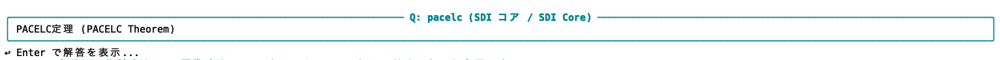
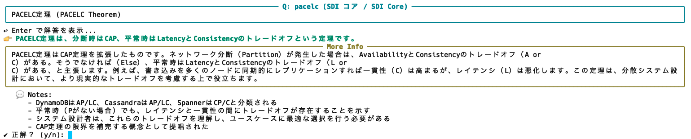
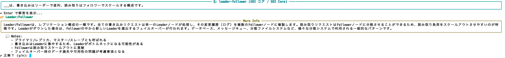

# SDI Flashcards

This project is a command-line flashcard application written in Python, designed to help users study and memorize terms and definitions using a spaced repetition system. The flashcard data is organized into multiple YAML files, allowing for easy management and categorization by genre. The application tracks user progress to prioritize cards due for review.

## Features

The application provides an interactive command-line interface for a flashcard-based learning experience.

### Normal Quiz

In a normal quiz, you are presented with a term and prompted to recall its definition.



After you provide an answer, the correct definition is displayed, along with feedback on whether your answer was correct.



### Reverse Quiz

In a reverse quiz, the roles are swapped: you are shown a definition and asked to recall the corresponding term.


Similarly, the correct term is revealed after you submit your answer.



### Statistics

You can view your learning progress and statistics for each card.


## Key Technologies

*   **Python 3:** Core application logic.
*   **PyYAML:** Used for parsing YAML card data.
*   **rich:** For rich text and beautiful terminal output.
*   **uv:** For efficient dependency management.
*   **JSON:** User's progress and state are stored in a JSON file (`~/.sdi_cards_state.json`).

## Architecture

The application's core logic resides in `recall.py`. Flashcard data is stored in YAML files within the `cards/` directory, now organized into more specific categories (e.g., `cards/database.yaml`, `cards/security.yaml`) and a dedicated `cards/google_cloud/` directory for GCP-specific services (e.g., `cards/google_cloud/compute.yaml`). The application can load cards from multiple YAML files within a specified directory, allowing for categorization of flashcards by topic or genre. User learning progress is persisted across sessions in a local JSON state file.

## Building and Running

### Dependencies

This project uses `uv` for dependency management. The required libraries are `PyYAML` and `rich`. You can install them by running:

```bash
uv sync
```

### Running the Application

The `recall.py` script now uses subcommands for different functionalities.

```bash
uv run python recall.py <command> [options]
```

### Commands and Options

*   **`quiz`**: Start a flashcard quiz.
    *   `-n, --count`: Set the number of questions per quiz (default: 15).
    *   `-r, --reverse`: Reverse quiz direction (show definition, ask for the term).
    *   `-v, --verbose`: Show long description, notes, and URLs for each card.
*   **`list`**: List all available cards.
    *   `-v, --verbose`: Show long description for each card.
*   **`stats`**: Show learning statistics.
*   **`info`**: Show information about flashcard files and card counts.

**Global Options (can be used with any command):**

*   `-f, --file`: Specify the path to the YAML file or directory containing YAML files (default: `cards/`).
*   `-t, --tags`: Filter cards by one or more tags (space-separated).

**Examples:**

To start a quiz with 10 questions tagged with "gcp" and "db" from the default `cards/` directory:

```bash
uv run python recall.py quiz -n 10 -t gcp db
```

To start a reverse quiz with verbose output:

```bash
uv run python recall.py quiz -r -v
```

To list all cards in the `cards/google_cloud/compute.yaml` file:

```bash
uv run python recall.py list -f cards/google_cloud/compute.yaml
```

To show information about your flashcard files:

```bash
uv run python recall.py info
```

## Development Conventions

*   **Code Style:** The code follows standard Python conventions (PEP 8).
*   **Data Management:** Flashcard content is managed in YAML files within the `cards/` directory. Each YAML file can contain multiple cards.
    *   **`meta.deck`**: The deck name is now an object with `ja` (Japanese) and `en` (English) keys, allowing for bilingual representation.
    *   **`notes`**: The `notes` field is a list of strings, allowing for multiple distinct notes per card.
    *   **`url`**: The `url` field is also a list of strings, enabling the inclusion of multiple reference URLs (e.g., official website, GitHub repository).
*   **State Management:** User progress is stored locally in the user's home directory (`~/.sdi_cards_state.json`), allowing the learning state to persist across sessions.
*   **Testing:** There are no automated tests in the project. Manual verification is performed by running the application with various options.