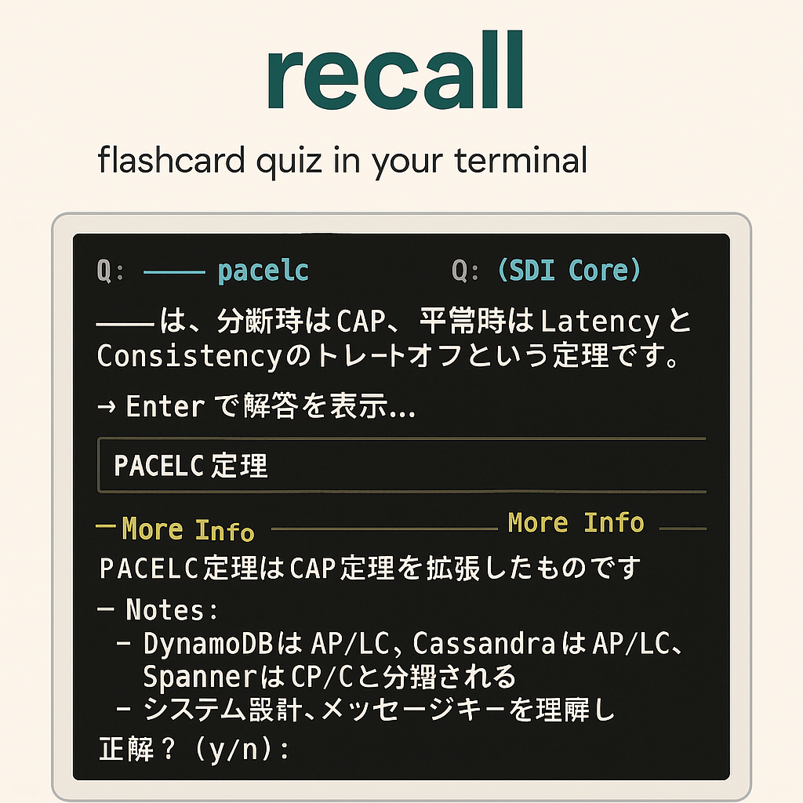
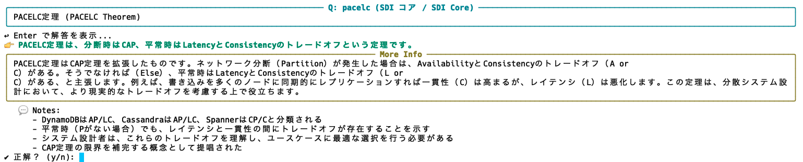
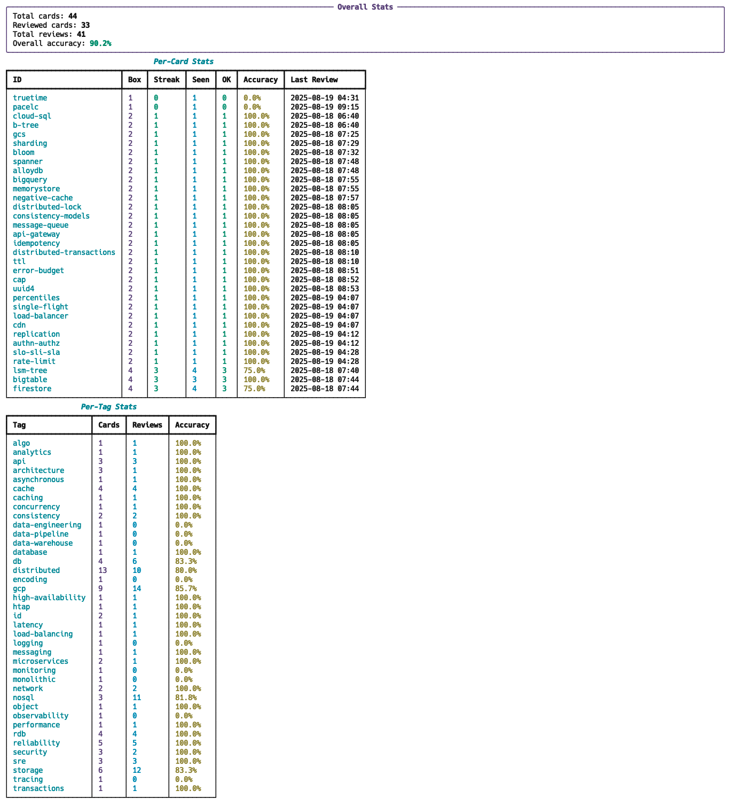

# recall



このプロジェクトは、Python で書かれたコマンドラインのフラッシュカードアプリケーションです。間隔反復システムを使用して、用語と定義を学習し記憶するのに役立ちます。フラッシュカードデータは複数の YAML ファイルに整理されており、ジャンルごとに簡単に管理および分類できます。アプリケーションは、復習が必要なカードを優先するためにユーザーの進捗を追跡します。

## 機能

このアプリケーションは、フラッシュカード学習のための対話的なコマンドラインインターフェースを提供します。

### 通常のクイズ

通常のクイズでは、用語が表示され、その定義を思い出すように求められます。


回答を送信すると、正解の定義が表示され、回答が正しかったかどうかのフィードバックが提供されます。



### 逆クイズ

逆クイズでは役割が逆になり、定義が表示され、対応する用語を思い出すように求められます。


同様に、回答を送信すると正解の用語が表示されます。


### 統計

各カードの学習進捗と統計を表示できます。



## 主要技術

*   **Python 3:** コアアプリケーションロジック。
*   **PyYAML:** YAML カードデータの解析に使用。
*   **rich:** リッチテキストと美しいターミナル出力用。
*   **uv:** 効率的な依存関係管理用。
*   **JSON:** ユーザーの進捗と状態は JSON ファイル (`~/.cards_state.json`) に保存されます。

## アーキテクチャ

アプリケーションのコアロジックは `recall.py` にあります。フラッシュカードデータは `cards/` ディレクトリ内の YAML ファイルに保存され、より具体的なカテゴリ（例: `cards/database.yaml`、`cards/security.yaml`）や、GCP固有のサービスのための専用ディレクトリ `cards/google_cloud/`（例: `cards/google_cloud/compute.yaml`）に整理されています。アプリケーションは、指定されたディレクトリ内の複数の YAML ファイルからカードを読み込むことができ、フラッシュカードをトピックやジャンルごとに分類できます。ユーザーの学習進捗は、ローカルの JSON 状態ファイルにセッション間で永続化されます。

## ビルドと実行

### 依存関係

このプロジェクトは、依存関係管理に `uv` を使用しています。必要なライブラリは `PyYAML` と `rich` です。以下のコマンドでインストールできます。

```bash
uv sync
```

### アプリケーションの実行

`recall.py` スクリプトは、異なる機能のためにサブコマンドを使用するようになりました。

```bash
uv run python recall.py <コマンド> [オプション]
```

### コマンドとオプション

*   **`quiz`**: フラッシュカードクイズを開始します。
    *   `-n, --count`: 質問数 (デフォルト: 15)。
    *   `-r, --reverse`: クイズの方向を反転 (定義 -> 用語)。
    *   `-v, --verbose`: 詳細な説明、ノート、URLを表示。
*   **`list`**: 利用可能なカードを一覧表示します。
    *   `-v, --verbose`: 各カードの詳細な説明を表示。
*   **`stats`**: 学習統計を表示します。
*   **`info`**: フラッシュカードファイルとカード数の情報を表示します。

**グローバルオプション (どのコマンドでも使用可能):**

*   `-p, --path`: YAML ファイルまたは YAML ファイルを含むディレクトリへのパス (デフォルト: `cards/`)。
*   `-t, --tags`: タグでカードをフィルタリング (スペース区切り)。

**例:**

デフォルトの `cards/` ディレクトリから「gcp」と「db」のタグが付いた10問のクイズを開始するには:

```bash
uv run python recall.py quiz -n 10 -t gcp db
```

詳細出力で逆クイズを開始するには:

```bash
uv run python recall.py quiz -r -v
```

`cards/google_cloud/compute.yaml` ファイル内のすべてのカードを一覧表示するには:

```bash
uv run python recall.py list -p cards/google_cloud/compute.yaml
```

フラッシュカードファイルに関する情報を表示するには:

```bash
uv run python recall.py info
```

## 開発規約

*   **コードスタイル:** コードは標準の Python 規約 (PEP 8) に従います。
*   **データ管理:** フラッシュカードコンテンツは `cards/` ディレクトリ内の YAML ファイルで管理されます。各 YAML ファイルには複数のカードを含めることができます。
    *   **`meta.deck`**: デッキ名は、バイリンガル表現を可能にする `ja` (日本語) と `en` (英語) のキーを持つオブジェクトになりました。
    *   **`notes`**: `notes` フィールドは文字列のリストであり、カードごとに複数の異なるノートを記述できます。
    *   **`url`**: `url` フィールドも文字列のリストであり、複数の参照 URL (例: 公式ウェブサイト、GitHub リポジトリ) を含めることができます。
*   **状態管理:** ユーザーの進捗は、ユーザーのホームディレクトリ (`~/.cards_state.json`) にローカルに保存され、学習状態がセッション間で永続化されます。
*   **テスト:** プロジェクトには自動テストがありません。手動での検証は、様々なオプションでアプリケーションを実行することで行われます。
